# EPL Badge Generator

A Variational Autoencoder (VAE) trained on 20,000 English Premier League club logo images that learns a compressed latent representation of each team's visual identity. All logos are encoded into latent space and per-club centroids are computed, which allows the model to interpolate between any two teams and generate a novel fused badge that blends their visual styles.

Images are preprocessed in parallel using `multiprocessing.Pool`. Each logo is converted to RGB, resized to 128×128 using LANCZOS resampling, normalized to [0, 1], and saved as a NumPy array. The VAE encoder uses four convolutional layers to progressively downsample the image to an 8×8 feature map, then produces a mean (μ) and log-variance (log σ²) vector in latent space via the reparameterization trick. The decoder mirrors this structure, using bilinear upsampling followed by convolutional layers to reconstruct the image, with a sigmoid activation to bound output pixels to [0, 1]. Bilinear upsampling was chosen over transposed convolutions as it produces smoother outputs at the cost of some sharpness, trading the checkerboard pixelation artifacts that transposed convolutions can introduce for a softer, more visually coherent result. Two model variants are available: a standard VAE (32–256 channels) and a larger VAE (64–512 channels) for higher capacity.

The project includes Hyperband hyperparameter tuning via Ray Tune to find optimal training configurations, KL annealing to prevent posterior collapse, and an interactive Gradio GUI where users select two EPL clubs and a blend weight to generate a fused logo in real time.
 
---

## Installation

```bash
python -m venv .venv
source .venv/bin/activate  # macOS/Linux

pip install torch torchvision pillow numpy matplotlib scikit-learn
pip install "ray[tune]" umap-learn gradio python-dotenv kaggle
```

**Kaggle setup** — the dataset downloads automatically. Configure credentials first:
1. Kaggle → Account → API → Create New Token → download `kaggle.json`
2. Place it at `~/.kaggle/kaggle.json` and run `chmod 600 ~/.kaggle/kaggle.json`

> **macOS/Jupyter note:** Set `num_workers=0` in both `preprocess_all_images` and `build_dataloaders` to avoid multiprocessing pickling issues.

---

## Running the Notebook

All code is in `EPL_Badge_Generator_Project.ipynb`.

**To train from scratch (GPU recommended — use Google Colab):**
Run all cells top to bottom. Hyperband tuning + full training takes ~4-5 hours on an A100.

**To test the GUI with pre-trained weights:**
Run all cells above **"Main Code"** to load function definitions, run **"Download Data"** to get the dataset, then skip to **"Instantiate Model Type for GUI Testing"** and run from there.

---

## Results

*All results below are from the optimized model (standard VAE, 250 epochs, Hyperband-tuned hyperparameters).*

**Generated Fusions:**

| Arsenal | Arsenal × Chelsea | Chelsea |
|:---:|:---:|:---:|
| 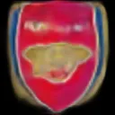 | 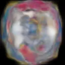 | 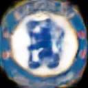 |

| Everton | Everton × Southampton | Southampton |
|:---:|:---:|:---:|
| 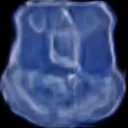 | 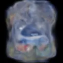 | 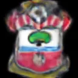 |

**Blend Progression (Leicester → Wolves):**

| Leicester (α=0) | α=0.25 | α=0.50 | α=0.75 | Wolves (α=1) |
|:---:|:---:|:---:|:---:|:---:|
| 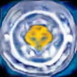 |  | 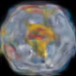 | 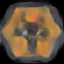 | 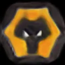 |

| Man City (α=0) | α=0.25 | α=0.50 | α=0.75 | Man United (α=1) |
|:---:|:---:|:---:|:---:|:---:|
| 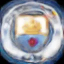 | 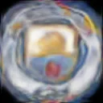 | 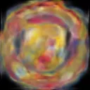 | 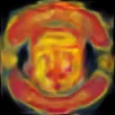 | 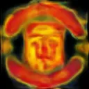 |

**Training and Validation Loss:**

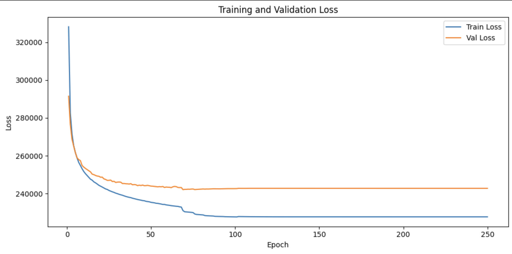

**Latent Space (t-SNE):**

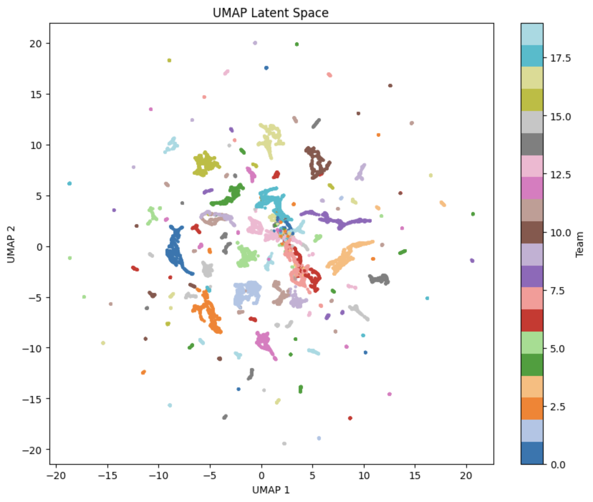

**Gradio GUI:**

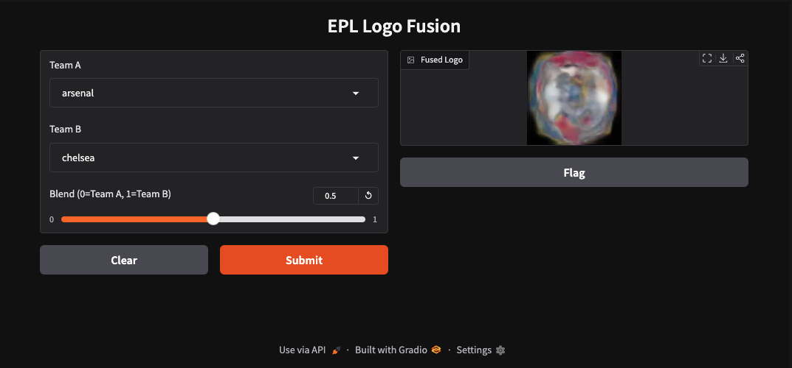

---

## Extra Criteria

**Hyperband Hyperparameter Tuning:** Rather than manually tuning hyperparameters, Ray Tune's `HyperBandScheduler` was used to search over `latent_dim`, `beta` (KL weight), learning rate, and batch size. Hyperband runs many short trials in parallel and aggressively prunes underperforming configurations early, focusing compute on the most promising hyperparameter combinations. The best config is automatically saved to `best_hparams.json` and loaded for the full training run.

**Latent Space Exploration:** After training, all images in the training set are passed through the encoder to extract their latent mean vectors (μ). These are grouped by team and averaged to produce a single centroid per club in latent space. Logo fusion is then performed by linearly interpolating between two team centroids  (`z = (1 - α) * centroid_a + α * centroid_b`) and decoding the result. A t-SNE visualization is generated to inspect the structure of the learned latent space and confirm that teams form meaningful clusters.

**GUI Visualization:** An interactive Gradio interface allows users to select any two EPL clubs from dropdown menus and control the blend weight with a slider ranging from 0 (pure Team A) to 1 (pure Team B). On submission, the interpolated latent vector is decoded in real time and the generated fused logo is displayed, making the latent space exploration tangible and interactive.

---

## Difficulties

**Posterior collapse** was the most significant challenge encountered during training. Early runs produced nearly identical outputs regardless of which two teams were selected, indicating the encoder had learned to ignore input images entirely and map everything to the same region of latent space. This was diagnosed by printing per-team centroid values which were all nearly identical and confirmed visually via a t-SNE plot showing no cluster structure. The root cause was an imbalance between reconstruction loss and KL divergence. Using `reduction='mean'` in the BCE loss made the reconstruction term very small relative to the KL term and gave the model no incentive to encode meaningful information. The fix involved switching to `reduction='sum'`, significantly lowering the β search range in Hyperband, and introducing KL annealing, or training with β=0 for the first 75 epochs so the model could develop strong reconstruction ability before latent space regularization was applied.

**Hyperband runtime** was a bottleneck when running on Google Colab. With 5 trials and 10 epochs per trial, tuning regularly took 3+ hours because Colab only allows access to one GPU, so parallelism across CPUs was the best method. Going forward, using Quest would allow more trials to run in parallel, significantly reducing tuning time and enabling a more thorough hyperparameter search.
